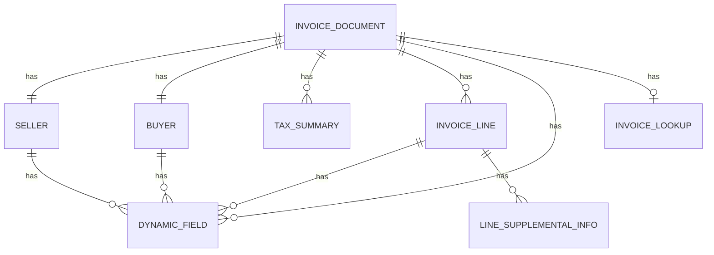

# KIẾN TRÚC DỮ LIỆU HDDT — TARGET v1.1.0

**Ứng dụng:** HDDT  
**Phiên bản mục tiêu:** 1.1.0  
**Ngày cập nhật:** 12/09/2026  
**Phạm vi:** dữ liệu hóa đơn điện tử mua vào từ Cổng HĐĐT GDT, gồm HĐĐT thường (`standard`) và HĐ khởi tạo từ máy tính tiền (`pos`).

> Tài liệu mô tả kiến trúc dữ liệu mục tiêu của v1.1.0 dựa trên source v1.0.1 và payload live đã cung cấp. Field/semantic chưa có đủ bằng chứng được giữ dạng raw hoặc đánh dấu chưa xác minh, không tự suy diễn.

## 1. Ma trận evidence hiện có

| Nguồn | API | Trạng thái | Mức xác minh |
|---|---|---:|---|
| `standard` | `/api/query/invoices/purchase` | 5 | list payload live |
| `standard` | `/api/query/invoices/purchase` | 6 | list payload live |
| `pos` | `/api/sco-query/invoices/purchase` | 8 | list payload live |
| `standard` | `/api/query/invoices/detail` | 6 | detail payload live |
| `pos` | `/api/sco-query/invoices/detail` | 8 | detail payload live |
| `standard` | `/api/query/invoices/export-xml` | - | baseline project contract/tests |
| `pos` | `/api/sco-query/invoices/export-xml` | - | path + locator supplied; method described as POST; response chưa capture |

POS detail đã xác minh trực tiếp với locator:

```text
nbmst + khhdon + shdon + khmshdon
```

## 2. Nguyên tắc dữ liệu

### 2.1 Ba chiều độc lập

```text
Direction        = purchase | sales
InvoiceSource    = standard | pos
ProcessingStatus = 5 | 6 | 8
```

Không được suy `InvoiceSource` từ `ttxly`, `thdon`, `tlhdon`, `hthdon`, `ladhddt` hoặc `mhdon`. Source được gắn từ namespace endpoint đang gọi.

### 2.2 Raw + normalized cùng tồn tại

Mỗi document giữ:

```text
rawSummary
rawDetail
normalized InvoiceDocument
```

Mục tiêu: audit, backward compatibility, không mất field mới của GDT, và có thể re-normalize sau này.

## 3. Mô hình logic



## 4. Identity và locator

### 4.1 GDT locator

```ts
interface InvoiceLocator {
  sellerTaxCode: string;      // nbmst
  templateNo: number|string;  // khmshdon
  series: string;             // khhdon
  invoiceNo: number|string;   // shdon
}
```

Không dùng `id` hoặc `mhdon` làm business locator bắt buộc. Standard detail `ttxly=6` xác nhận `mhdon` có thể `null` trong khi locator trên vẫn đầy đủ.

### 4.2 Key nội bộ v1.1.0

```text
direction|invoiceSource|sellerTaxCode|templateNo|series|invoiceNo
```

Source bắt buộc nằm trong key để tránh dedupe nhầm giữa `/query` và `/sco-query`.

## 5. InvoiceDocument mục tiêu

```ts
type InvoiceSource = 'standard' | 'pos';

interface InvoiceDocument {
  key: string;
  direction: Direction;
  invoiceSource: InvoiceSource;

  portalInvoiceId?: string;
  documentTypeCode?: string;
  documentTypeName?: string;
  templateNo?: number|string;
  series?: string;
  invoiceNo?: number|string;

  issueDate?: string;
  signingTime?: string;
  receivedTime?: string;
  codedTime?: string;
  updatedTime?: string;

  seller: Party;
  buyer: Party;

  currency?: string;
  exchangeRate?: number;
  subtotal?: number;
  nonTaxableAmount?: number;
  discountAmount?: number;
  vatAmount?: number;
  feeAmount?: number;
  otherAmount?: number;
  grandTotal?: number;
  grandTotalInWords?: string;
  paymentMethod?: string;

  invoiceStatus?: number|string;
  processingStatus?: number|string;
  nature?: number|string;

  providerCode?: string;
  lookup?: InvoiceLookup;
  qrCode?: string;

  taxSummaries: TaxSummary[];
  lines: InvoiceLine[];
  dynamicFields: DynamicField[];

  rawSummary?: unknown;
  rawDetail?: unknown;
}
```

## 6. Header mapping GDT → normalized

| GDT | Normalized | Ghi chú |
|---|---|---|
| `id` | `portalInvoiceId` | UUID portal, không phải business locator |
| `hdon` | `documentTypeCode` | mã loại |
| `thdon` | `documentTypeName` | có thể null |
| `tlhdon` | `documentTypeName` fallback | standard6 xác nhận cần fallback |
| `khmshdon` | `templateNo` | locator |
| `khhdon` | `series` | locator |
| `shdon` | `invoiceNo` | locator |
| `tdlap` | `issueDate` | ISO timestamp |
| `nky` | `signingTime` | live field |
| `ntnhan` | `receivedTime` | live field |
| `ncma` | `codedTime` | có thể null |
| `ncnhat` | `updatedTime` | live field |
| `dvtte` | `currency` | POS detail mẫu không có |
| `tgia` | `exchangeRate` | có thể null |
| `tgtcthue` | `subtotal` | trước thuế |
| `tgtthue` | `vatAmount` | VAT |
| `ttcktmai` | `discountAmount` | nullable |
| `tgtphi` | `feeAmount` | standard có thể có |
| `tgtkhac` | `otherAmount` | standard có thể có |
| `tgtttbso` | `grandTotal` | tổng thanh toán |
| `tgtttbchu` | `grandTotalInWords` | nullable |
| `thtttoan` | `paymentMethod` | text hiển thị ưu tiên |
| `htttoan` | `paymentMethod` fallback | thường là numeric code |
| `tthai` | `invoiceStatus` | preserve code |
| `ttxly` | `processingStatus` | preserve code |
| `tchat` | `nature` | preserve code |
| `qrcode` | `qrCode` | detail đã xác nhận |
| `ngcnhat` | `providerCode` | standard có thể có |
| `tentvandnkntt` | `providerCode` fallback | POS xác nhận |

Không tự gán nghĩa pháp lý cho code nếu chưa có bảng mã chính thức/capture đủ mạnh.

## 7. Party

```ts
interface Party {
  taxCode?: string;
  name?: string;
  address?: string;
  bankAccount?: string;
  bankName?: string;
  phone?: string;
  email?: string;
  fax?: string;
  website?: string;
  identityNo?: string;
  dynamicFields: DynamicField[];
}
```

Seller live fields:

```text
nbmst nbten nbdchi nbstkhoan nbtnhang
nbsdthoai nbdctdtu nbfax nbwebsite nbttkhac
```

Buyer live fields:

```text
nmmst nmten nmdchi nmstkhoan nmtnhang
nmsdthoai nmdctdtu nmcmnd nmcccd nmttkhac
```

POS detail xác nhận `nmcccd` là field riêng.

## 8. DynamicField

Format live dùng chung standard/POS:

```json
{
  "ttruong": "Hilo-SearchKey",
  "kdlieu": "string",
  "dlieu": "..."
}
```

Contract:

```ts
interface DynamicField {
  section: string;
  name: string;       // ttruong
  dataType?: string;  // kdlieu
  rawValue: unknown;  // dlieu
}
```

Containers đã quan sát:

```text
cttkhac
nbttkhac
nmttkhac
ttkhac
ttttkhac
hdhhdvu[].ttkhac
```

Parser priority:

```text
name: ttruong -> ten -> name -> key -> ma
type: kdlieu -> kieu -> type
value: dlieu
```

## 9. TaxSummary

POS detail xác nhận một invoice có thể đồng thời:

```text
8%
KCT
```

```ts
interface TaxSummary {
  vatRateText?: string;
  taxableAmount?: number;
  vatAmount?: number;
  vatRateValue?: number;
}
```

Mapping:

```text
thttltsuat[].tsuat  -> vatRateText
thttltsuat[].thtien -> taxableAmount
thttltsuat[].tthue  -> vatAmount
```

Không ép `KCT`/`KKKNT` thành number.

## 10. InvoiceLine

Nguồn line chính: `hdhhdvu[]`.

```ts
interface InvoiceLine {
  itemCode?: string;           // mhhdvu / ma
  portalLineId?: string;       // id
  portalInvoiceId?: string;    // idhdon
  lineNo?: number;             // stt
  sortOrder?: number;          // sxep
  lineType?: number|string;    // tchat
  itemName?: string;           // ten
  unit?: string;               // dvtinh
  quantity?: number;           // sluong
  unitPrice?: number;          // dgia
  amount?: number;             // thtien
  vatRateText?: string;        // ltsuat
  vatRate?: number;            // tsuat
  vatAmount?: number;          // tthue
  amountBeforeTax?: number;    // thtcthue
  discountRate?: number;       // tlckhau
  discountAmount?: number;     // stckhau
  amountInWords?: string;      // stbchu
  currency?: string;           // dvtte
  exchangeRate?: number;       // tgia
  dynamicFields: DynamicField[];
  supplementalInfo: LineSupplementalInfo[];
  raw?: unknown;
}
```

### 10.1 Standard detail đã quan sát

Line có thể có `dvtte`, `tgia`.

### 10.2 POS detail đã quan sát

Có `mhhdvu`, ví dụ:

```text
TRANSPORTATION_FEE
DISCOUNT
PLATFORM_FEE
```

Line có `ttkhac[]` riêng.

## 11. LineSupplementalInfo — `tthhdtrung`

POS detail xác nhận:

```json
{
  "lhhdtrung": 2,
  "ttruong": "BKSPTVChuyen",
  "dlieu": "29E-132.93"
}
```

Nên mô hình hóa:

```ts
interface LineSupplementalInfo {
  type?: number|string;
  name?: string;
  rawValue?: unknown;
}
```

Dùng cho metadata dòng đặc thù ngành như biển kiểm soát, bảng kê, tham chiếu nghiệp vụ. Vẫn giữ raw line để không mất field chưa biết.

## 12. Field riêng POS detail

Quan sát trong POS detail nhưng không có trong standard6 detail mẫu:

```text
cnhan
idtbhgthdon
idtbhgtrinh
kqchtmloi
mtthdtbssrs
nmcccd
nmhvtnmhang
nmloai
tentvandnkntt
tghdmman
tghdmmldo
```

Nguyên tắc:
- promote field có semantic rõ và cần nghiệp vụ;
- field còn lại giữ trong `rawDetail`;
- tránh phình domain model chỉ vì field xuất hiện một lần.

## 13. Merge summary + detail

Detail override summary khi value khác `null/undefined`, nhưng raw vẫn giữ riêng.

Sau merge phải kiểm tra:
- source không đổi;
- locator không đổi;
- key không đổi.

Nếu detail trả locator khác summary: warning/fail-safe, không merge âm thầm.

## 14. Nullability

Standard `ttxly=6` chứng minh nhiều field null hợp lệ (`mhdon`, `thdon`, `nky`, `ncma`, `tgia`, địa chỉ...).

Quy tắc:
- normalized fields optional;
- không bịa giá trị thiếu;
- chỉ fallback giữa field có semantic tương đương đã xác minh;
- raw giữ nguyên null.

## 15. Currency và amount

Không mặc định POS là VND chỉ vì sample giao dịch có vẻ nội địa. Nếu payload không có currency:
- kế thừa summary nếu summary có;
- nếu cả summary/detail không có thì giữ `undefined` trừ khi business rule được xác minh riêng.

UI totals group theo currency, không cộng chéo tiền tệ.

## 16. Lookup

Dynamic fields có thể chứa `Fkey`, `PortalLink`, `Hilo-SearchKey`, `Mã số bí mật`, `MaTimKiem`.

Không phải tất cả có cùng semantic. `InvoiceLookup` cần `sourceField` + confidence và lookup extractor phải whitelist/score thay vì lấy field đầu tiên.

## 17. Dataset v1.1.0

Mỗi normalized document phải lưu `invoiceSource`.

Legacy dataset không có source:
- migration-on-read có thể default `standard`;
- chỉ áp dụng legacy, không áp dụng live response.

Nên bổ sung `sourceCounts` trong metadata.

## 18. Download artifact model

Task phải giữ:

```ts
invoiceSource
locator
type: 'xml' | 'zip'
```

Routing:

```text
standard -> /api/query/invoices/export-xml
pos      -> /api/sco-query/invoices/export-xml
```

Thông tin mới mô tả POS export là POST; cần full capture trước khi khóa transport contract.

## 19. Thông tin còn thiếu để đóng v1.1.0

### P0
1. Full capture POS export: method, headers, body, status, response headers, response bytes/file, filename.
2. POS list `ttxly=5` payload thật.
3. POS list `ttxly=6` payload thật.
4. POS cursor page 2 có `state`.
5. POS detail/export error/session-expired contract.
6. Standard `ttxly=8` nếu thực tế phải hỗ trợ.

### P1
7. Standard detail `ttxly=5/8`.
8. POS detail `ttxly=5/6`.
9. Mẫu điều chỉnh/thay thế/số âm/ngoại tệ/multiple VAT/KCT/KKKNT/discount/no-lines/buyer-no-MST.
10. XML POS sample.

### v1.2.0 discovery
11. API xem bản thể hiện.
12. API tải bản thể hiện.
13. MIME/filename/render/security requirements.

## 20. Kết luận

Detail mới nâng data model mục tiêu thành:

```text
InvoiceDocument
├── Header
├── Seller
├── Buyer
├── TaxSummary[]
├── InvoiceLine[]
│   ├── DynamicField[]
│   └── LineSupplementalInfo[]
├── Invoice DynamicField[]
├── Lookup
├── QR
├── RawSummary
└── RawDetail
```

POS detail hiện là capability đã có evidence trực tiếp. Khoảng trống lớn nhất còn lại cho v1.1.0 là transport/response POS export và coverage POS status 5/6.

## TVAN PDF supervised adapter: tvan_invoice / M-Invoice (v1.2.1 r9)

For GDT invoices with `ngcnhat=tvan_invoice` or `msttcgp/tvandnkntt=0106026495`, the provider adapter maps `nbmst` to `masothue` and the dynamic field `Số bảo mật` to `sobaomat`. The confirmed PDF endpoint is `GET https://tracuuhoadon.minvoice.com.vn/api/Search/SearchInvoice?masothue=...&sobaomat=...&type=PDF&inchuyendoi=false`. This provider is P1 (`captchaMode=none`). The supervised detail card constructs the exact link without provider I/O; automatic preview/batch performs the GET through the allow-listed backend and validates `%PDF-` bytes.

## TVAN supervised adapter: tvan_softdreams / SoftDreams EasyInvoice (v1.2.1 r10)

`tvan_softdreams` is identified by `ngcnhat=tvan_softdreams` or `msttcgp/tvandnkntt=0105987432`. GDT exposes `PortalLink` and `Fkey` in `ttkhac`; both are surfaced under **Chi tiết hóa đơn → Tra cứu / TVAN**. The observed production workflow is seller-specific Portal -> `GET /Captcha/Show` -> `POST /Search/Search` (`typeSearch`, `FKey`, `Capcha`) -> backend-private opaque token + rendered HTML -> `POST /Invoice/DownloadPdfAndFileAttachFromAvailableHtml` -> `{fileGuid,fileName}` -> final `GET /Invoice/Download?...`. Provider cookies/token/HTML remain backend-only. SoftDreams is classified P3/per-invoice CAPTCHA until evidence shows reusable CAPTCHA/session semantics. Final ZIP downloads are safely inspected and the PDF entry is validated before entering the common TVAN PDF viewer/batch pipeline.
